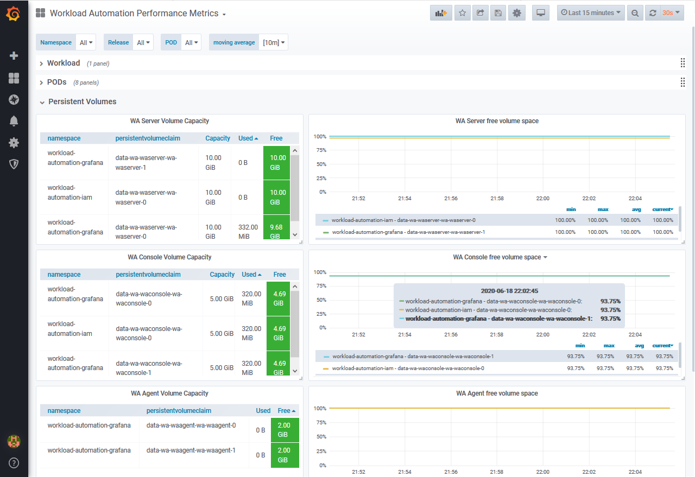

# IBM Workload Automation

## Introduction
To ensure a fast and responsive experience when using IBM Workload Automation, you can deploy IBM Workload Automation on a cloud infrastructure. A cloud deployment ensures access anytime anywhere and is a fast and efficient way to get up and running quickly. It also simplifies maintenance, lowers costs, provides rapid upscale and downscale, minimizes IT requirements and physical on-premises data storage.

As more and more organizations move their critical workloads to the cloud, there is an increasing demand for solutions and services that help them easily migrate and manage their cloud environment.

To respond to the growing request to make automation opportunities more accessible, IBM Workload Automation containers can be deployed into the following supported third-party cloud provider infrastructures:

-  Amazon Web Services (AWS) Elastic Kubernetes Service (EKS)
-  Microsoft&reg; Azure Kubernetes Service (AKS)
-  Google Kubernetes Engine (GKE)

IBM Workload Automation is a complete, modern solution for batch and real-time workload management. It enables organizations to gain complete visibility and control over attended or unattended workloads. From a single point of control, it supports multiple platforms and provides advanced integration with enterprise applications including ERP, Business Analytics, File Transfer, Big Data, and Cloud applications.

The information in this README contains the steps for deploying the following IBM Workload Automation components using a chart and container images:

 > **IBM Workload Automation**, which comprises master domain manager and its backup, Dynamic Workload Console, and Dynamic Agent
 
 
 For more information about IBM Workload Automation, see the product documentation library in [IBM Documentation]( https://www.ibm.com/docs/workload-scheduler/10.1.0).
 
## Details

By default, a single  server (master domain manager), Dynamic Workload Console (console) and dynamic agent is installed. 

To achieve high availability in an IBM Workload Automation environment, the minimum base configuration is composed of 2 Dynamic Workload Consoles and 2 servers (master domain managers). For more details about IBM Workload Automation and high availability, see: 

[An active-active high availability scenario](https://www.ibm.com/docs/workload-scheduler/10.1.0?topic=scheduler-active-active-high-availability-scenario).


IBM Workload Automation can be deployed across a single cluster, but you can add multiple instances of the product components by using a different namespace in the cluster. The product components can run in multiple failure zones in a single cluster.

In addition to the product components, the following objects are installed:
 
  
|  |Agent  |Console  |Server (MDM)  |
|--|--|--|--|
| **Deployments** |   |  |  |
|**Pods**  |wa-waagent-0  |wa-waconsole-0  |wa-waserver-0  |
|**Stateful Sets**  |wa-waagent for dynamic agent |wa-waconsole  |wa-waserver  |
|**Secrets**  | |wa-pwd-secret  |wa-pwd-secret  |
|**Certificates (Secret)**  |wa-waagent | wa-waserver  |wa-waserver  |
|**Network Policy**  |da-network-policy | dwc-network-policy  |mdm-network-policy <br>allow-mdm-to-mdm-network-policy  |
|**Services**  |wa-waagent-h  |wa-waconsole wa-waconsole-h  |wa-waserver wa-waserver-h  |
|**PVC** (generated from Helm chart). Default deployment includes a single (replicaCount=1) server, console, agent. Create a PVC for each instance of each component.  | 1 PVC data-wa-waagent-waagent0 |1 PVC data-wa-waconsole-waconsole0  |1 PVC data-wa-waserver-waserver0  |
|**PV** (Generated by PVC)  | 1 PV |1 PV  |1 PV  |
|**Service Accounts**  |  |  |  |
|**Roles**  |wa-pod-role  | wa-pod-role | wa-pod-role |
|**Role Bindings**  |wa-pod-role-binding |wa-pod-role-binding  |wa-pod-role-binding  |
|**Cluster Roles**  | {{ .Release.Namespace }}-wa-pod-cluster-role-get-routes (name of clusterRole and, where {{ .Release.Namespace }} represents the name of the namespace \<workload_automation_namespace>) | {{ .Release.Namespace }}-wa-pod-cluster-role-get-routes  | {{ .Release.Namespace }}-wa-pod-cluster-role-get-routes  |
|**Cluster Role Bindings**  |{{ .Release.Namespace }}-wa-pod-cluster-role-get-routes-binding (name of ClusterRoleBinding and, where {{ .Release.Namespace }} represents the name of the namespace \\<workload_automation_namespace>) |{{ .Release.Namespace }}-wa-pod-cluster-role-get-routes-binding  |{{ .Release.Namespace }}-wa-pod-cluster-role-get-routes-binding |
|**Ingress** or **Load Balancer**|  Depends on the type of network enablement that is configured. See [Network enablement](#network-enablement)  |

 **Data encryption**: 
 * Data in transit encrypted using TLS 1.2
 * Data at rest encrypted using passive disk encryption.
 * Secrets are stored in an approved Kubernetes Secrets.
 * Logs are clear of all sensitive information. 

## Supported Platforms

-  Amazon Elastic Kubernetes Service (EKS) on amd64: 64-bit Intel/AMD x86
-  Azure Kubernetes Service (AKS) on amd64: 64-bit Intel/AMD x86
-  Google Kubernetes Engine (GKE) on amd64: 64-bit Intel/AMD x86

### Openshift support
You can deploy IBM Workload Automation on Openshift 4.2 or later version by following the instruction in this documentation and using helm charts. 
For Server and Console component ensure to modify the value of these parameters:
- waserver.server.exposeServiceType
- waconsole.console.exposeServiceType
	
From `LoadBalancer` to `Routes`
	
	
## Accessing the container images

You can access the IBM Workload Automation chart and container images from the Entitled Registry. See [Create the secret](#create-the-secret) for more information about accessing the registry. The images are as follows:


* cp.icr.io/cp/ibm-workload-automation-agent-dynamic:10.1.0.00.20220722
* cp.icr.io/cp/ibm-workload-automation-server:10.1.0.00.20220722
* cp.icr.io/cp/ibm-workload-automation-console:10.1.0.00.20220722


 
## Prerequisites
Before you begin the deployment process, ensure your environment meets the following prerequisites:
- Helm 3.0
- OpenSSL
- Grafana and Prometheus for monitoring dashboard
- Jetstack cert-manager
- Ingress controller: to manage the ingress service, ensure an ingress controller is correctly configured. For example, to configure an NGINX ingress controller, ensure the following option is set if NGINX is installed using a Helm chart: `"controller.extraArgs.enable-ssl-passthrough"`. Refer to the [NGINX Ingress Controller documentation](https://kubernetes.github.io/ingress-nginx/) for more details.
- Kubernetes version: >=1.15 (no specific APIs need to be enabled)
- `kubectl` command-line tool to control Kubernetes clusters 
- API key for accessing IBM Entitled Registry: `cp.icr.io`

The following are prerequisites specific to each supported cloud provider:

 
- Amazon Kubernetes Service (EKS) installed and running
- AWS CLI (AWS command line)

 
- Azure Kubernetes Service (AKS) installed and running
- azcli (Azure command line)

 
- Google Kubernetes Engine (GKE) installed and running
- gcloud SDK (Google command line)

### Storage classes static PV and dynamic provisioning

 
| Provider            | Disk Type    | PVC Size | PVC Access Mode |
| ------------------- | ------------ | -------- |---------------- |
| AWS EBS             | GP2 SSD      | Default  | ReadWriteOnce   |
| AWS EBS             | IO1 SSD      | Default  | ReadWriteOnce   |

For additional details about AWS storage settings, see [Storage classes](https://docs.aws.amazon.com/eks/latest/userguide/storage-classes.html).

 
| Provider               | Disk Type    | PVC Size | PVC Access Mode |
| ---------------------- | ------------ | -------- |---------------- |
| Azure File             |     SSD      | Default  | ReadWriteOnce   |
| Azure Disk             |     SSD      | Default  | ReadWriteOnce   |

**Note:** The volumeBindingMode must be set to **WaitforFirstConsumer** and not **Immediate**. 
For additional details about Microsoft Azure storage settings, see [Azure Files - Dynamic](https://docs.microsoft.com/en-us/azure/aks/azure-files-dynamic-pv).


| Provider               | Disk Type                | PVC Size | PVC Access Mode |
| ---------------------- | -------------------------| -------- |---------------- |
| GCP                    |Standard Persistent Disks | Default  | ReadWriteOnce   |
| GCP                    |Balanced Persistent Disks | Default  | ReadWriteOnce   |
| GCP                    |SSD Persistent Disks      | Default  | ReadWriteOnce   |


For more details about the storage requirements for your persistent volume claims, see the **[Storage](#storage)** section of this README file.

## Resources Required
  
 The following resources correspond to the default values required to manage a production environment. These numbers might vary depending on the environment.
 
| Component | Container resource limit | Container memory request |
|--|--|--|
|**Server**  | CPU: 4, Memory: 16Gi |CPU: 1, Memory: 6Gi, Storage: 10Gi  |
|**Console**  | CPU: 4, Memory: 16Gi  |CPU: 1, Memory: 4Gi, Storage: 5Gi  |
| **Dynamic Agent** |CPU: 1, Memory: 2Gi |CPU: 200m, Memory: 200Mi, Storage size: 2Gi  |

## Installing

Installing and configuring IBM Workload Automation, involves the following high-level steps:

1. [Create the Namespace](#create-the-namespace).
2. [Creating a Kubernetes Secret](#create-the-secret) by accessing the entitled registry to store an entitlement key for the IBM Workload Automation offering on your cluster. 
3. [Securing communication](#securing-communication) using either Jetstack cert-manager or using your custom certificates.
4. [Creating a secrets file](#creating-a-secrets-file) to store passwords for the console and server components, or if you use custom certificates, to add your custom certificates to the Certificates Secret.
5. (For Microsoft Azure AKS and Google GKE only) [Configuring the Microsoft Azure SQL server database](#configuring-the-microsoft-azure-sql-server-database) or [Configuring the Google Cloud SQL for SQL Server
 database](#configuring-the-google-cloud-sql-for-sql-server-database).
6. [Installing Automation Hub integrations](#installing-automation-hub-integrations).
7. [Installing custom integrations](#installing-custom-integrations).
5. [Deploying the product components](#deploying-the-product-components).
6. [Verifying the installation](#verifying-the-installation).


### Create the Namespace

To create the namespace, run the following command:

        kubectl create namespace <workload_automation_namespace>
	

### Create the Secret 

 

Obtain your entitlement key and store it on your cluster by creating a [Kubernetes Secret](https://kubernetes.io/docs/concepts/configuration/secret/). Using a Kubernetes secret allows you to securely store the key on your cluster and access the registry to download the chart and product images. 

1. Access the entitled registry. 
Log in to [MyIBM Container Software Library](https://myibm.ibm.com/products-services/containerlibrary) with the IBMid and password that are associated with the entitled software.


2.  In the **Container software library** tile, click **View library** and then click **Copy key** to copy the entitlement key to the clipboard. 


3. To create a pull secret for your entitlement key that enables access to the entitled registry, run the following command:

         kubectl create secret docker-registry -n <workload_automation_namespace> sa-<workload_automation_namespace> --docker-server=<registry_server> --docker-username=<user_name> --docker-password=<password>
	   
	where,
	* <workload_automation_namespace> represents the namespace where the product components are installed
	* <registry_server> is `cp.icr.io`
	* <user_name> is `cp`
	* \<password> is the entitled key copied from the entitled registry `<api_key>`

		
### Securing communication

You secure communication using certificates. You can manage certificates using either the Jetstack cert-manager or using your own custom certificates. For information about using your own certificates, see the section [Configuring](#configuring). For more information about Jetstack cert-manager, see the [cert-manager documentation](https://cert-manager.io/docs/).

Cert-manager is a Kubernetes addon that automates the management and issuance of TLS certificates. It verifies periodically that certificates are valid and up-to-date, and takes care of renewing them before they expire.

1. Create the namespace for cert-manager.
    
        kubectl create namespace cert-manager

2. Install cert-manager using a Helm chart by running the following commands:

   a. `helm repo add jetstack https://charts.jetstack.io`
   
   If you are using k8s 1.22 or later:
    
   b. `helm install cert-manager jetstack/cert-manager --namespace cert-manager --set installCRDs=true`	
   
   Otherwise if you are on k8s 1.21 or below:
   
   b. `helm install cert-manager jetstack/cert-manager --namespace cert-manager --version v0.15.1 --set installCRDs=true`	
	
3. Create the Certificate Authority (CA) by running the following commands:

   a.   `.\openssl.exe genrsa -out ca.key 2048`
    
   b.   `.\openssl.exe req -x509 -new -nodes -key ca.key -subj "/CN=WA_ROOT_CA" -days 3650 -out ca.crt`
	
4.  Create the CA key pair secret by running the following command:

        kubectl create secret tls ca-key-pair --cert=ca.crt --key=ca.key -n <workload_automation_namespace>

5. Create the Issuer under the namespace. Edit the issuer.yaml file with the namespace and CA key pair.

    a. If you are using k8s 1.22 or later, create the issuer.yaml as follows, specifying the namespace and CA key pair:
	
        apiVersion: cert-manager.io/v1
        kind: Issuer
        metadata:
          labels:
            app.kubernetes.io/name: cert-manager
          name: wa-ca-issuer
          namespace: <workload_automation_namespace>
        spec:
          ca:
            secretName: ca-key-pair
	    
    a. Otherwise if you are on k8s 1.21 or below:
	
        apiVersion: cert-manager.io/v1alpha2
        kind: Issuer
        metadata:
          labels:
            app.kubernetes.io/name: cert-manager
          name: wa-ca-issuer
          namespace: <workload_automation_namespace>
        spec:
          ca:
            secretName: ca-key-pair

    b. Run the following command to create the issuer under the namespace:		  

        kubectl apply -f issuer.yaml -n <workload_automation_namespace>
		
### Creating a secrets file
Create a secrets file to store passwords for the server, console and database, or if you use custom certificates, to add your custom certificates to the Certificates Secret.

##### Create secrets file to store passwords for the console and server components

1. Manually create a mysecret.yaml file to store passwords. The mysecret.yaml file must contain the following parameters:

	    apiVersion: v1
	    kind: Secret
	    metadata:
	      name: wa-pwd-secret
	      namespace: <workload_automation_namespace>
	    type: Opaque
	    data:
	       WA_PASSWORD: <hidden_password>
	       DB_ADMIN_PASSWORD: <hidden_password>
	       DB_PASSWORD: <hidden_password>	
	       SSL_PASSWORD: <hidden_password>
     
where:
     
   - **wa-pwd-secret** is the value of the pwdSecretName parameter defined in the [Configuration Parameters](#configuration-parameters) section;    
   - **<workload_automation_namespace>** is the namespace where you are going to deploy the IBM Workload Automation product components.  
   - **<hidden_password>** must be entered; to enter an encrypted password, run the following command in a UNIX shell and copy the output into the yaml file:
	    `echo -n 'mypassword' | base64`

> **Note a**: The `echo` command must be launched separately for each password that you want to enter as an encrypted password in the mysecret.yaml:
   - WA_PASSWORD: \<hidden password>
   - DB_ADMIN_PASSWORD: \<hidden password>
   - DB_PASSWORD: \<hidden password>    
   - SSL_PASSWORD: \<hidden password>
> **Note b**: The SSL_PASSWORD parameter is required only if you use custom certificates in PEM format.

2. Once the file has been created and filled in, it must be imported.

   a. From the command line, log in to the cluster.
	
   b. Apply the WA-Secret (wa-pwd-secret). Create a secrets file to store passwords for both the server and console components. Launch the following command:
	
	    kubectl apply -f <my_path>/mysecret.yaml -n <workload_automation_namespace>
	  
where **<my_path>** is the location path of the mysecret.yaml file.	

### Configuring the Microsoft Azure SQL server database ###

 

Running the IBM Workload Automation product containers within Azure AKS gives you access to services such as a highly scalable cloud database service. You can deploy and run any of the following Azure SQL Server database models in the Azure cloud, depending on your needs:

- SQL server database
- SQL managed instance
- SQL virtual machine

To use the database with both the server and console components, set the `type` parameter to `type= MSSQL` in the values.yaml file, and then configure the database settings in the same file according to the chosen database model as follows:

  **SQL database server and SQL managed instance:** 
  
 | Server               | Console              |
| -------------------- | -------------------- |
| sslConnection: false | sslConnection: false |
| tsLogName: PRIMARY   | tsName: PRIMARY      |
| tsLogPath: null      |                      |
| tsName: PRIMARY      |                      |
| tsPath: null         | tsPath: null         |
| tsPlanName: PRIMARY  |                      |
| tsPlanPath: null     |                      |
| tsTempName: null     | tsTempName: null     |
| tssbspace: null      | tssbspace: null      |
| type: MSSQL          |  type: MSSQL         |
| usepartitioning: true|usepartitioning: true |
| user: <db_user>      | user: <db_user>      |	


For the SQL managed instance database model, ensure that the hostname is the IP address or hostname used to connect to the Azure database for MSSQL.

**SQL virtual machine:** 

| Server                          | Console                    |
| ------------------------------- | -------------------------- |
| sslConnection: false            | sslConnection: false       |
| tsLogName: TWS\_LOG             | tsName: TWS\_DATA\_DWC     |
| tsLogPath: /var/opt/mssql/data  |                            |
| tsName: TWS\_DATA               |                            |
| tsPath: /var/opt/mssql/data     | tsPath: /var/opt/mssql/dat |
| tsPlanName: TWS\_PLAN           |                            |
| tsPlanPath: /var/opt/mssql/data |                            |
| tsTempName: null                | tsTempName: null           |
| tssbspace: null                 | tssbspace: null            |
| type: MSSQL                     | type: MSSQL                |
| usepartitioning: true           | usepartitioning: true      |
| user: <db_user>                 | user: >db_user>            |
 	
	
### Configuring the Google Cloud SQL for SQL Server database ###

 

Running the IBM Workload Automation product containers within Google GKE gives you access to services such as a secure and compliant cloud database service. You can deploy and run the following Google Cloud SQL for SQL Server database model in the Google GPC cloud:

- Google Cloud SQL for SQL Server

To use the database with both the server and console components, set the `type` parameter to `type= MSSQL` in the values.yaml file, and then configure the database settings in the same file as follows:

  **SQL database server and SQL managed instance:** 
  
 | Server               | Console              |
| -------------------- | -------------------- |
| sslConnection: false | sslConnection: false |
| tsLogName: PRIMARY   | tsName: PRIMARY      |
| tsLogPath: null      |                      |
| tsName: PRIMARY      |                      |
| tsPath: null         | tsPath: null         |
| tsPlanName: PRIMARY  |                      |
| tsPlanPath: null     |                      |
| tsTempName: null     | tsTempName: null     |
| tssbspace: null      | tssbspace: null      |
| type: MSSQL          |  type: MSSQL         |
| usepartitioning: true|usepartitioning: true |
| user: <db_user>      | user: <db_user>      |	

### Installing Automation Hub integrations  

You can extend Workload Automation with a number of out-of-the-box integrations, or plug-ins. Complete documentation for the integrations is available on [Automation Hub](https://www.yourautomationhub.io/). Use this procedure to integrate only the integrations you need to automate your business workflows.

**Note:** You must perform this procedure before deploying the server and console components. Any changes made post-installation are applied the next time you perform an upgrade.

The following procedure describes how you can create and customize a *configMap* file to identify the integrations you want to make available in your Workload Automation environment:

1) Create a .yaml file, for example, **plugins-config.yaml**, with the following content. This file name will need to be specified in a subsequent step.

		####################################################################
		# Licensed Materials Property of HCL*
		# (c) Copyright HCL Technologies Ltd. 2021. All rights reserved.
		#
		# * Trademark of HCL Technologies Limited
		####################################################################

		apiVersion: v1
		kind: ConfigMap
		metadata:
		  name: <configmap_name>
		data:
		  plugins.properties: |
		      com.hcl.scheduling.agent.kubernetes
		      com.hcl.scheduling.agent.udeploycode
		      com.hcl.wa.plugin.ansible
		      com.hcl.wa.plugin.automationanywherebotrunner
		      com.hcl.wa.plugin.automationanywherebottrader
		      com.hcl.wa.plugin.awscloudformation
		      com.hcl.wa.plugin.awslambda
		      com.hcl.wa.plugin.awssns
		      com.hcl.wa.plugin.awssqs
		      com.hcl.wa.plugin.azureresourcemanager
		      com.hcl.wa.plugin.blueprism
		      com.hcl.wa.plugin.compression
		      com.hcl.wa.plugin.encryption
		      com.hcl.wa.plugin.gcpcloudstorage
		      com.hcl.wa.plugin.gcpdeploymentmanager
		      com.hcl.wa.plugin.jdedwards
		      com.hcl.wa.plugin.obiagent
		      com.hcl.wa.plugin.odiloadplan
		      com.hcl.wa.plugin.oraclehcmdataloader
		      com.hcl.wa.plugin.oracleucm
		      com.hcl.wa.plugin.saphanaxsengine
		      com.hcl.waPlugin.chefbootstrap
		      com.hcl.waPlugin.chefrunlist
		      com.hcl.waPlugin.obirunreport
		      com.hcl.waPlugin.odiscenario
		      com.ibm.scheduling.agent.apachespark
		      com.ibm.scheduling.agent.aws
		      com.ibm.scheduling.agent.azure
		      com.ibm.scheduling.agent.biginsights
		      com.ibm.scheduling.agent.centralizedagentupdate
		      com.ibm.scheduling.agent.cloudant
		      com.ibm.scheduling.agent.cognos
		      com.ibm.scheduling.agent.database
		      com.ibm.scheduling.agent.datastage
		      com.ibm.scheduling.agent.ejb
		      com.ibm.scheduling.agent.filetransfer
		      com.ibm.scheduling.agent.hadoopfs
		      com.ibm.scheduling.agent.hadoopmapreduce
		      com.ibm.scheduling.agent.j2ee
		      com.ibm.scheduling.agent.java
		      com.ibm.scheduling.agent.jobdurationpredictor
		      com.ibm.scheduling.agent.jobmanagement
		      com.ibm.scheduling.agent.jobstreamsubmission
		      com.ibm.scheduling.agent.jsr352javabatch
		      com.ibm.scheduling.agent.mqlight
		      com.ibm.scheduling.agent.mqtt
		      com.ibm.scheduling.agent.mssqljob
		      com.ibm.scheduling.agent.oozie
		      com.ibm.scheduling.agent.openwhisk
		      com.ibm.scheduling.agent.oracleebusiness
		      com.ibm.scheduling.agent.pichannel
		      com.ibm.scheduling.agent.powercenter
		      com.ibm.scheduling.agent.restful
		      com.ibm.scheduling.agent.salesforce
		      com.ibm.scheduling.agent.sapbusinessobjects
		      com.ibm.scheduling.agent.saphanalifecycle
		      com.ibm.scheduling.agent.softlayer
		      com.ibm.scheduling.agent.sterling
		      com.ibm.scheduling.agent.variabletable
		      com.ibm.scheduling.agent.webspheremq
		      com.ibm.scheduling.agent.ws

4) In the **plugins-config.yaml** file, assign a name of your choice to the configmap:

		name: <configmap_name>
		
5) Assign this same name to the `Global.pluginImageName` parameter in the **values.yaml file**. See [Global parameters](#global-parameters) for more information about this global parameter.		

6) Delete the lines related to the integrations you do not want to make available in your environment. The remaining integrations will be integrated into Workload Automation at deployment time. Save your changes to the file.

   You can always refer back to this readme file and add an integration back into the file in the future. The integration becomes available the next time you update the console and server containers.
   
7) To apply the configMap to your environment and integrate the plug-ins, run the following command:

        kubectl apply -f plugins_config.yaml -n <workload_automation_namespace>
	
	
Proceed to deploy the product components. After the deployment, you can include jobs related to these integrations when defining your workload.	

### AIDA configuration
To configure AIDA, please see the following readme: [AIDA](aida/readme.md)

### Installing custom integrations

In addition to the integrations available on Automation Hub, you can extend Workload Automation with custom plug-ins that you create. For information about creating a custom plug-in, see [Workload Automation Lutist Development Kit](https://www.yourautomationhub.io/toolkit) on Automation Hub.

To install a custom plug-in and make it available to be used in your workload, perform the following steps before deploying or upgrading the console and server components:

1) Create a new folder with a name of your choosing, for example, "my_custom_plugins".

2) Create a Dockerfile with the following content and save it to the new folder as is, "my_custom_plugins". This file does not require any customization.

		FROM registry.access.redhat.com/ubi8:8.3

		ENV WA_BASE_UID=999
		ENV WA_BASE_GID=0
		ENV WA_USER=wauser
		ENV WA_USER_HOME=/home/${WA_USER}

		USER 0

		RUN echo "Creating \"${WA_USER}\" user for Workload Automation and assign it to group \"${WA_BASE_GID}\"" \
		&& userdel systemd-coredump \
		&& if  [ ${WA_BASE_GID} -ne 0 ];then \
		groupadd -g ${WA_BASE_GID} -r ${WA_USER};fi \
		&& /usr/sbin/useradd -u ${WA_BASE_UID} -m -d ${WA_USER_HOME} -r -g ${WA_BASE_GID} ${WA_USER}

		RUN mkdir -p /opt/wa_plugins /opt/wautils /tmp/custom_plugins
		COPY plugins/* /opt/wa_plugins/

		RUN chown -R ${WA_BASE_UID}:0 /opt/wa_plugins \
		&& chmod -R 755 /opt/wa_plugins

		COPY copy_custom_plugins.sh /opt/wautils/copy_custom_plugins.sh

		RUN chmod 755 /opt/wautils/copy_custom_plugins.sh \
		&& chown ${WA_BASE_UID}:${WA_BASE_GID} /opt/wautils/copy_custom_plugins.sh

		USER ${WA_BASE_UID}

		CMD [ "/opt/wautils/copy_custom_plugins.sh" ] 

3) Create another file specifically with the name: **copy_custom_plugins.sh**. The file must contain the following content, and it must be saved to the new folder, "my_custom_plugins":

		#!/bin/sh
		####################################################################
		# Licensed Materials Property of HCL*
		# (c) Copyright HCL Technologies Ltd. 2021. All rights reserved.
		#
		# * Trademark of HCL Technologies Limited
		####################################################################


		copyCustomPlugins(){
		    SOURCE_PLUGINS_DIR=$1
		    REMOTE_PLUGINS_DIR=$2


		    echo "I: Starting copy of custom plugins...." 
		    if [ -d "${SOURCE_PLUGINS_DIR}" ] && [ -d "${REMOTE_PLUGINS_DIR}" ];then
			echo "I: Copying custom plugins...." 
			cp --verbose -R ${SOURCE_PLUGINS_DIR} ${REMOTE_PLUGINS_DIR}
		    fi
		}

		###############
		#MAIN
		###############

		copyCustomPlugins $1 $2

4) Create a sub-folder specifically named: "plugins", in the new folder "my_custom_plugins".

5) Copy your custom .jar plug-ins to the "plugins" sub-folder.

6) Run the following command to build the Docker image:

        docker build -t <your_docker_registry_name>/<your_image_name>:<your_tag> .
	
   where <your_docker_registry_name> is the name of your docker registry, <your_image_name> is the name of your Docker image, and <your_tag> is the tag you assigned to your Docker image.
  
7) Run the following command to push the Docker image to the registry:

        docker push <your_docker_registry_name>/<your_image_name>:<your_tag>
	
8) Configure the `customPluginImageName` parameter in the values.yaml file with the name of the image and tag built in the previous steps. See [Global parameters](#global-parameters) for more information about this parameter.

        customPluginImageName: <your_docker_registry_name>/<your_image_name>:<your_tag>
	
Proceed to deploy the product components. After the deployment, you can include jobs related to your custom plug-ins when defining your workload.	


### Deploying the product components		

To deploy the IBM Workload Automation components, ensure you have first downloaded the chart from the IBM Entitled Registry: `cp.icr.io` and have unpacked it to a local directory. If you already have the chart then update it.

1. Download the chart from the repository and unpack it to a local directory or, if you already have the chart, update it.

   **First time installation and configuration of the chart:**

   a. Add the repository:
   
        helm repo add <repo_name> https://workloadautomation.github.io/ibm-workload-automation-chart/stable, where <repo_name> represents the name of the chosen local repository
   
   b.  Update the Helm chart:
   
        helm repo update 
   
   c. Pull the Helm chart:


        helm pull <repo_name>/workload-automation-prod


>**Note:** If you want to download a specific version of the chart use the --version option in the helm pull command. You will find the list of all charts with their versions inside the directory ibm-workload-automation-chart/stable

      
     
**Update your chart:**

        helm repo update 	 
		
1. Customize the deployment. Configure each product component by adjusting the values in the `values.yaml` file. See these parameters and their default values in [Configuration Parameters](#configuration-parameters). By default, a single server, console, and agent is installed.

>**Note:**  If you specify the `waconsole.engineHostName` and `waconsole.enginePort` parameters in the `values.yaml` file, only a single engine connection related to an engine external to the cluster is automatically defined in the Dynamic Workload Console using the values assigned to these parameters. By default, the values for these parameters are blank, and the server is deployed within the cluster and the engine connection is related to the server in the cluster. If, instead, you deploy both a server within the cluster and one external to the cluster, a single engine connection is automatically created in the console using the values of the parameters related to the external engine (server). If you require an engine connection to the server deployed within the cluster, you must define the connection manually. 
	 
3. Deploy the instance by running the following command: 


        helm install -f values.yaml <workload_automation_release_name> <repo_name>/workload-automation-prod -n <workload_automation_namespace>


where, <workload_automation_release_name> is the deployment name of the instance. 
**TIP:** Because this name is used in the server component name and the pod names, use a short name or acronym when specifying this value to ensure it is readable.

The following are some useful Helm commands:

* To list all of the Repo releases: 

        helm list -A
	
* To update the Helm release:

        helm upgrade <workload_automation_release_name> <repo_name>/ibm-workload-automation-prod -f values.yaml -n <workload_automation_namespace>
	
* To delete the Helm release: 

        helm uninstall <workload_automation_release_name> -n <workload_automation_namespace>
		

### Verifying the installation

After the deployment procedure is complete, you can validate the deployment to ensure that everything is working. 

To manually verify that the installation was successfully installed, you can perform the following checks:
 
1. Run the following command to verify the pods installed in the <workload_automation_namespace>:
   
           kubectl get pods -n <workload_automation_namespace>
	   
2. Locate the master pod name that is in the format `<workload_automation_release_name>-wauser-0`.   
		   
3. To access the master pod, open a bash shell and run the following command:
	
        kubectl exec -ti <workload_automation_release_name>-waserver-0 -n <workload_automation_namespace> -- /bin/bash
		
4. Access the IBM Workload Automation pod and run the following commands:
 
   a. **Composer list workstation**: lists the workstation definitions in the database


        composer li cpu=/@/@
		
     An example of the output for this command is as follows:	
     
  
  

   
  	 
  
		
   b. **Conman Showpus**: lists all workstations in the plan

        conman sc /@/@
		
   An example of the output for this command is as follows:

  
 

 
     
	
   c. **Global option command optman ls**:
	 
        optman ls
		
This command lists the current values of all IBM Workload Automation global options. For more information about the global options see [Global Options - detailed description](https://www.ibm.com/docs/workload-scheduler/10.1.0?topic=options-global-detailed-description).	
	
* **Verify that the default engine connection is created from the Dynamic Workload Console**

Verifying the default engine connection depends on the network enablement configuration you implement. To determine the URL to be used to connect to the console, follow the procedure for the appropriate network enablement configuration.

**For load balancer:**

1. Run the following command to obtain the token to be inserted in https://\<loadbalancer>:9443/console to connect to the console:

 
	
        kubectl get svc <workload_automation_release_name>-waconsole-lb  -o 'jsonpath={..status.loadBalancer.ingress..hostname}' -n <workload_automation_namespace>


       kubectl get svc <workload_automation_release_name>-waconsole-lb  -o 'jsonpath={..status.loadBalancer.ingress..ipaddress}' -n <workload_automation_namespace>
       


       kubectl get svc <workload_automation_release_name>-waconsole-lb  -o 'jsonpath={..status.loadBalancer.ingress..ipaddress}' -n <workload_automation_namespace>


2. With the output obtained, replace \<loadbalancer> in the URL https://\<loadbalancer>:9443/console.

**For ingress:**

1. Run the following command to obtain the token to be inserted in https://\<ingress>/console to connect to the console:


        kubectl get ingress/<workload_automation_release_name>-waconsole -o 'jsonpath={..host}'-n <workload_automation_namespace>
  
2.   With the output obtained, replace \<ingress> in the URL https://\<ingress>/console.

**Logging into the console:**

1. Log in to the console by using the URLs obtained in the previous step.

2. For the credentials, specify the user name (wauser) and password (wa-pwd-secret, the passwrod specified when you created the secrets file to store passwords for the server, console and database).
	
3. From the navigation toolbar, select **Administration -> Manage Engines**.
	
4.  Verify that the default engine, **engine_wa-waserver** is dsplayed in the Manage Engines list:

  
 


To ensure the Dynamic Workload Console logout page redirects to the login page, modify the value of the logout url entry available in file authentication_config.xml:


       <jndiEntry value="${logout.url}" jndiName="logout.url" />

where the logout.url string in jndiName should be replaced with the logout URL of the provider.
		

## Upgrading the Chart

Before you upgrade a chart, verify if there are jobs currently running and manually stop the related processes or wait until the jobs complete.	To upgrade the release <workload_automation_release_name> to a new version of the chart, run the following command from the directory where the values.yaml file is located:

 `helm upgrade release_name <repo_name>/workload-automation-prod -f values.yaml -n <workload_automation_namespace>`

If you have configured a configMaps file as described in [Installing Automation Hub integrations](installing-automation-hub-integrations), this upgrade procedure automatically upgrades any integrations or plug-ins previously installed from Automation Hub.

## Rolling Back the Chart

Before you roll back a chart, verify if there are jobs currently running and manually stop the related processes or wait until the jobs complete. To roll back the <workload_automation_release_name> release to a previous version of the chart, run the following commands:

1.	Identify the revision number to which you want to roll back by running the command:

        helm history <workload_automation_release_name> -n <workload_automation_namespace>
		
2.	Roll back to the specified revision number:

        helm rollback <workload_automation_release_name>  <revision-number> -n <workload_automation_namespace>
  
## Uninstalling the Chart

 To uninstall the deployed components associated with the chart and clean up the orphaned Persistent Volumes, run:
 
 1. Uninstall the workload-automation-prod deployment, run:

        helm uninstall release_name -n <workload_automation_namespace> 

    The command removes all of the Kubernetes components associated with the chart and uninstalls the <workload_automation_release_name> release.
	
2. Clean up orphaned Persistent Volumes by running the following command:

       kubectl delete pvc -l <workload_automation_release_name> -n <workload_automation_namespace> 

		
## Configuration Parameters

The following tables list the configurable parameters of the chart, **values.yaml**, an example of the values and the default values. The tables are organized as follows:

- **[Global parameters](#global-parameters)** (all product components)
- **[Agent parameters](#agent-parameters)**
- **[Dynamic Workload Console parameters](#dynamic-workload-console-parameters)**
- **[Server parameters](#server-parameters)** (master domain manager)  

&nbsp;  
-  #### Global parameters
The following table lists the global configurable parameters of the chart relative to all product components and an example of their values:

| **Parameter**                           | **Description**                                                                                                                                                                                                                                                              | **Mandatory**  | **Example**                      | **Default**                      |
| --------------------------------------- | ---------------------------------------------------------------------------------------------------------------------------------------------------------------------------------------------------------------------------------------------------------------------------- | -------------  | -------------------------------- | -------------------------------- |
| global.license                          | Use ACCEPT to agree to the license agreement                                                                                                                                                                                                                                 | yes            | not accepted                     | not accepted                     |
| global.enableServer                     | If enabled, the Server application is deployed                                                                                                                                                                                                                               | no             | true                             | true                             |
| global.enableConsole                    | If enabled, the Console application is deployed                                                                                                                                                                                                                              | no             | true                             | true                             |
| global.enableAgent                      | If enabled, the Agent application is deployed                                                                                                                                                                                                                                | no             | true                             | true                             |
| global.serviceAccountName               | The name of the serviceAccount to use. The IBM Workload Automation default service account (**wauser**) and not the default cluster account                                                                                                                                                                                                                                          | no             | default                          | ** wauser**            |
| global.language                         | The language of the container internal system. The supported language are: en (English), de (German), es (Spanish), fr (French), it (Italian), ja (Japanese), ko (Korean), pt_BR (Portuguese (BR)), ru (Russian), zh_CN (Simplified Chinese) and zh_TW (Traditional Chinese) | yes            | en                               | en                               |  
| global.customLabels                      | This parameter contains two fields: *name* and *value*. Insert customizable labels to group resources linked together.                                                                                                                                                                                                                               | no             | name: environment value: prod                             | name: environment value: prod                             |
| global.enablePrometheus                          | Use to enable (true) or disable (false) Prometheus metrics                                                                                                                                                                                                                                 | no            | true                     |true                     |
| global.pluginImageName                          | The container plugin image name | true | | 
| global.customPlugins                          | If specified, the plug-ins and integrations listed in the configMap file are automatically installed when deploying the server and console containers.  See [Installing Automation Hub integrations](#installing-automation-hub-integrations) for details about the procedure.                                                                                                                                                                                                                            | no            | mycustomplugin (the value specified must match the value specified in the configMap file)   |        |
| global.customPluginsImageName                 | To install a custom plug-in when deploying the server and console containers, specify the name of the Docker registry, the plug-in image, and the tag assigned to the Docker image. See [Installing custom integrations](#installing-custom-integrations) for details about the procedure.                                                                                                                                                                                                                             | no            | myregistry/mypluginimage:my_tag   |        |

-  #### Agent parameters
The following table lists the configurable parameters of the chart relative to the agent and an example of their values:

| **Parameter**                                    | **Description**                                                                                                                                                                                                                                                      | **Mandatory**  | **Example**                      | **Default**                      |
| ------------------------------------------------ | -------------------------------------------------------------------------------------------------------------------------------------------------------------------------------------------------------------------------------------------------------------------  | -------------  | -------------------------------- | -------------------------------- |
| waagent.fsGroupId                                | The secondary group ID of the user                                                                                                                                                                                                                                   | no             | 999                              |                                  |
| waagent.supplementalGroupId                      | Supplemental group id of the user                                                                                                                                                                                                                                    | no             |                                  |                                  |
| waagent.replicaCount                             | Number of replicas to deploy                                                                                                                                                                                                                                         | yes            | 1                                | 1                                |
| waagent.image.repository                         | IBM Workload Automation Agent image repository                                                                                                                                                                                                                                | yes            | @DOCKER.AGENT.IMAGE.NAME@        | @DOCKER.AGENT.IMAGE.NAME@        |
| waagent.image.tag                                | IBM Workload Automation Agent image tag                                                                                                                                                                                                                                       | yes            | @VERSION@                        | @VERSION@                        |
| waagent.image.pullPolicy                         | image pull policy                                                                                                                                                                                                                                                    | yes            | Always                           | Always                           |
| waagent.licenseType                            | Product license type (IBM Workload Scheduler only)                                                                                                                                                                                                                                                             | yes           | PVU                           | PVU                       |
| waagent.agent.name                               | Agent display name                                                                                                                                                                                                                                                   | yes            | WA_AGT                           | WA_AGT                           |
| waagent.agent.tz                                 | If used, it sets the TZ operating system environment variable                                                                                                                                                                                                        | no             | America/Chicago                  |                                  |
| waagent.agent.networkpolicyEgress                                 | Customize egress policy. Controls network traffic and how a component pod is allowed to communicate with other pods. If empty, no egress policy is defined                                                                                                                                                                                                        | no             | See [Network enablement](#network-enablement)                  |                                  |
| waagent.agent.nodeAffinityRequired                 | A set of rules that determines on which nodes an agent can be deployed using custom labels on nodes and label selectors specified in pods.                                                                                                                                                                                                                           | no             |   See [Network enablement](#network-enablement)              |                               |
| waagent.agent.dynamic.server.mdmhostname         | Hostname or IP address of the master domain manager                                                                                                                                                                                                                  | no (mandatory if a server is not present inside the same namespace)            | wamdm.demo.com                   |                                  |
| waagent.agent.dynamic.server.port                | The HTTPS port that the dynamic agent must use to connect to the master domain manager                                                                                                                                                                               | no             | 31116                            | 31116                            |
| waagent.agent.dynamic.pools*                      | The static pools of which the Agent should be a member                                                                                                                                                                                                               | no             | Pool1, Pool2                     |                                  |
| waagent.agent.dynamic.useCustomizedCert          | If true, customized SSL certificates are used to connect to the master domain manager                                                                                                                                                                                | no             | false                            | false                            |
| waagent.agent.dynamic.certSecretName             | The name of the secret to store customized SSL certificates                                                                                                                                                                                                          | no             | waagent-cert-secret              |                                  |
| waagent.agent.containerDebug                     | The container is executed in debug mode                                                                                                                                                                                                                              | no             | no                               | no                               |
| waagent.agent.livenessProbe.initialDelaySeconds  | The number of seconds after which the liveness probe starts checking if the server is running                                                                                                                                                                        | yes            | 60                               | 60                               | 
| waagent.resources.requests.cpu                   | The minimum CPU requested to run                                                                                                                                                                                                                                     | yes            | 200m                             | 200m                             | 
| waagent.resources.requests.memory                | The minimum memory requested to run                                                                                                                                                                                                                                  | yes            | 200Mi                            | 200Mi                            | 
| waagent.resources.limits.cpu                     | The maximum CPU requested to run                                                                                                                                                                                                                                     | yes            | 1                                | 1                                | 
| waagent.resources.limits.memory                  | The maximum memory requested to run                                                                                                                                                                                                                                  | yes            | 2Gi                              | 2Gi                              | 
| waagent.persistence.enabled                      | If true, persistent volumes for the pods are used                                                                                                                                                                                                                    | no             | true                             | true                             |
| waagent.persistence.useDynamicProvisioning       | If true, StorageClasses are used to dynamically create persistent volumes for the pods                                                                                                                                                                               | no             | true                             | true                             | 
| waagent.persistence.dataPVC.name                 | The prefix for the Persistent Volumes Claim name                                                                                                                                                                                                                     | no             | data                             | data                             |
| waagent.persistence.dataPVC.storageClassName     | The name of the Storage Class to be used. Leave empty to not use a storage class                                                                                                                                                                                     | no             | nfs-dynamic                      |                                  |
| waagent.persistence.dataPVC.selector.label       | Volume label to bind (only limited to single label)                                                                                                                                                                                                                  | no             | my-volume-label                  |                                  |
| waagent.persistence.dataPVC.selector.value       | Volume label value to bind (only limited to single value)                                                                                                                                                                                                            | no             | my-volume-value                  |                                  |
| waagent.persistence.dataPVC.size                 | The minimum size of the Persistent Volume                                                                                                                                                                                                                            | no             | 2Gi                              | 2Gi                              |
| waserver.persistence.extraVolumes               | A list of additional extra volumes                                                                                                                                                                                                                             | no            | custom-volume-1                             |                                              |
| waserver.persistence.extraVolumeMounts               | A list of additional extra volumes mounts                                                                                                                                                                                                                            | no            | custom-volume-1                             |                                              |


>\(*) **Note:** for details about static agent workstation pools, see: 
[Workstation](https://www.ibm.com/docs/workload-scheduler/10.1.0?topic=objects-workstation).


- #### Dynamic Workload Console parameters
The following table lists the configurable parameters of the chart relative to the console and an example of their values:

| **Parameter**                                       | **Description**                                                                                                                                                                                                                                                        | **Mandatory** | **Example**                      | **Default**                                        |
| --------------------------------------------------- | --------------------------------------------------------------------------------------------------------------------------------------------------------------------------------------------------------------------------------------------------------------------   | ------------- | -------------------------------- | ------------------------------------------         |
| waconsole.fsGroupId                                 | The secondary group ID of the user                                                                                                                                                                                                                                     | no            | 999                              |                                                    |
| waconsole.supplementalGroupId                       | Supplemental group id of the user                                                                                                                                                                                                                                      | no            |                                  |                                                    |
| waconsole.replicaCount                              | Number of replicas to deploy                                                                                                                                                                                                                                           | yes           | 1                                | 1                                                  |
| waconsole.image.repository                          | IBM Workload Automation Console image repository                                                                                                                                                                                                                                | yes           | @DOCKER.CONSOLE.IMAGE.NAME@      |                        |
| waconsole.image.tag                                 | IBM Workload Automation Console image tag                                                                                                                                                                                                                                       | yes           | @VERSION@                        |                                           |
| waconsole.image.pullPolicy                          | Image pull policy                                                                                                                                                                                                                                                      | yes           | Always                           | Always                                             |
| waconsole.console.containerDebug                    | The container is executed in debug mode                                                                                                                                                                                                                                | no            | no                               | no                                                 |
| waconsole.console.db.type                           | The preferred remote database server type (e.g. DERBY, DB2, ORACLE, MSSQL, IDS). Use Derby database only for demo or test purposes.                                                                                                                                    | yes           | DB2                              | DB2                                                |
| waconsole.console.db.hostname                       | The Hostname or the IP Address of the database server                                                                                                                                                                                                                  | yes           | \<dbhostname>                     |                                                    |
| waconsole.console.db.port                           | The port of the database server                                                                                                                                                                                                                                        | yes           | 50000                            | 50000                                              |
| waconsole.console.db.name                           | Depending on the database type, the name is different; enter the name of the Server's database for DB2/Informix/OneDB/MSSQL, enter the Oracle Service Name for Oracle                                                                                                        | yes           | TWS                              | TWS                                                |
| waconsole.console.db.server                           | The name of the Informix or OneDB database server                                                                                                               | yes only for IDS or ONEDB           | IDS                              |  
| waconsole.console.db.tsName                         | The name of the DATA table space                                                                                                                                                                                                                                       | no            | TWS_DATA                         |                                                    |
| waconsole.console.db.tsPath                         | The path of the DATA table space                                                                                                                                                                                                                                       | no            | TWS_DATA                         |                                                    |
| waconsole.console.db.tsTempName                     | The name of the TEMP table space (Valid only for Oracle)                                                                                                                                                                                                               | no            | TEMP                             | leave it blank                                     |
| waconsole.console.db.tssbspace                      | The name of the SB table space (Valid only for IDS).                                                                                                                                                                                                                   | no            | twssbspace                       | twssbspace                                         |
| waconsole.console.db.user                           | The database user who accesses the Console tables on the database server. In case of Oracle, it identifies also the database. It can be specified in a secret too                                                                                                      | yes           | db2inst1                         |                                                    |
| waconsole.console.db.adminUser                      | The database user administrator who accesses the Console tables on the database server. It can be specified in a secret too                                                                                                                                            | yes           | db2inst1                         |                                                    |
| waconsole.console.db.sslConnection                  | If true, SSL is used to connect to the database (Valid only for DB2)	                                                                                                                                                                                               | no            | false                            | false                                              |
| waconsole.console.db.usepartitioning                | Enable the Oracle Partitioning feature. Valid only for Oracle. Ignored for other databases                                                                                                                                                                             | no            | true                       	  | true                                               |
| waconsole.engineHostName                     | By default, the value of this parameter is set to blank. Specify this parameter together with the waconsole.enginePort parameter so that an engine connection is automatically defined using the specified host name and port number after deployment of the console.                                    | no           |      01.102.104.104              | blank 
| waconsole.enginePort                     | By default, the value of this parameter is set to blank. Specify this parameter together with the waconsole.engineHostName parameter so that an engine connection is automatically defined using the specified host name and port number after deployment of the console.                                     | no           |      31116             | blank 
| waconsole.console.pwdSecretName                     | The name of the secret to store all passwords                                                                                                                                                                                                                          | yes           | wa-pwd-secret                    | wa-pwd-secret                                      |
| waconsole.console.livenessProbe.initialDelaySeconds | The number of seconds after which the liveness probe starts checking if the server is running                                                                                                                                                                          | yes           | 100                              | 100                                                | 
| waconsole.console.useCustomizedCert                 | If true, customized SSL certificates are used to connect to the Dynamic Workload Console                                                                                                                                                                               | no            | false                            | false                                              |
| waconsole.console.tz                                | If used, it sets the TZ operating system environment variable                                                                                                                                                                                                           | no            | America/Chicago                  |                                                  |
| waconsole.console.certSecretName                    | The name of the secret to store customized SSL certificates                                                                                                                                                                                                            | no            | waconsole-cert-secret            |                                                    |
| waconsole.console.libConfigName                     | The name of the ConfigMap to store all custom liberty configuration                                                                                                                                                                                                    | no            | libertyConfigMap                 |                                                    |
| waconsole.console.routes.enabled                   | If true, the ingress controller rules is enabled                                                                                                                                                                                                                       | no            | true                             | true                                               |
| waconsole.resources.requests.cpu                    | The minimum CPU requested to run                                                                                                                                                                                                                                       | yes           | 1                                | 1                                                  | 
| waconsole.resources.requests.memory                 | The minimum memory requested to run                                                                                                                                                                                                                                    | yes           | 4Gi                              | 4Gi                                                | 
| waconsole.resources.limits.cpu                      | The maximum CUP requested to run                                                                                                                                                                                                                                       | yes           | 4                                | 4                                                  | 
| waconsole.resources.limits.memory                   | The maximum memory requested to run                                                                                                                                                                                                                                    | yes           | 16Gi                             | 16Gi                                               | 
| waconsole.persistence.enabled                       | If true, persistent volumes for the pods are used                                                                                                                                                                                                                      | no            | true                             | true                                               |
| waconsole.persistence.useDynamicProvisioning        | If true, StorageClasses are used to dynamically create persistent volumes for the pods                                                                                                                                                                                 | no            | true                             | true                                               |
| waconsole.persistence.dataPVC.name                  | The prefix for the Persistent Volumes Claim name                                                                                                                                                                                                                       | no            | data                             | data                                               |
| waconsole.persistence.dataPVC.storageClassName      | The name of the StorageClass to be used. Leave empty to not use a storage class                                                                                                                                                                                        | no            | nfs-dynamic                      |                                                    |
| waconsole.persistence.dataPVC.selector.label        | Volume label to bind (only limited to single label)                                                                                                                                                                                                                    | no            | my-volume-label                  |                                                    |
| waconsole.persistence.dataPVC.selector.value        | Volume label value to bind (only limited to single label)                                                                                                                                                                                                              | no            | my-volume-value                  |                                                    |
| waconsole.persistence.dataPVC.size                  | The minimum size of the Persistent Volume                                                                                                                                                                                                                              | no            | 5Gi                              | 5Gi                                                |
| waserver.persistence.extraVolumes               | A list of additional extra volumes                                                                                                                                                                                                                             | no            | custom-volume-1                             |                                              |
| waserver.persistence.extraVolumeMounts               | A list of additional extra volumes mounts                                                                                                                                                                                                                            | no            | custom-volume-1                             |                                              |
| waconsole.console.exposeServiceType            | The network enablement configuration implemented. Valid values: LOAD BALANCER or INGRESS   | yes           |     INGRESS                          |                                                | 
| waconsole.console.exposeServiceAnnotation      | Annotations of either the resource of the service or the resource of the ingress, customized in accordance with the cloud provider   | yes           |                               |                     |
| waconsole.console.networkpolicyEgress      | Customize egress policy. Controls network traffic and how a component pod is allowed to communicate with other pods. If empty, no egress policy is defined | no | See [Network enablement](#network-enablement)|
| waconsole.console.ingressHostName      | The virtual hostname defined in the DNS used to reach the Console.   | yes, only if the network enablement implementation is INGRESS           |                               |                     | 
| waconsole.console.ingressSecretName      | The name of the secret to store certificates used by ingress. If not used, leave it empty.   | yes, only if the network enablement implementation is INGRESS.     |      |  wa-console-ingress-secret | 	
| waconsole.console.nodeAffinityRequired                 | A set of rules that determines on which nodes a console can be deployed using custom labels on nodes and label selectors specified in pods.                                                                                                                                                                                                                           | no             | See [Network enablement](#network-enablement)       |                               |


- #### Server parameters
The following table lists the configurable parameters of the chart and an example of their values:

| **Parameter**                            | **Description**                                                                                                                                                                                                                                                               | **Mandatory** | **Example**                      | **Default**                                      |
| ---------------------------------------- | ----------------------------------------------------------------------------------------------------------------------------------------------------------------------------------------------------------------------------------------------------------------------------  | ------------- | -------------------------------- | -------------------------------------------      |
| waserver.replicaCount                             | Number of replicas to deploy                                                                                                                                                                                                                                                   | yes           | 1                                | 1                                                |
| waserver.image.repository                         | IBM Workload Automation server image repository                                                                                                                                                                                                                                        | yes           | <*repository_url*>       | The name of the image server repository                      |
| waserver.image.tag                                | IBM Workload Automation server image tag                                                                                                                                                                                                                                               | yes           | 1.0.0                        | the server image tag                                        |
| waserver.image.pullPolicy                         | Image pull policy                                                                                                                                                                                                                                                             | yes           | Always                           | Always                                           |
| waserver.licenseType                            | Product license type (IBM Workload Scheduler only)                                                                                                                                                                                                                                                            | yes           | PVU                           | PVU                       |
| waserver.fsGroupId                                | The secondary group ID of the user                                                                                                                                                                                                                                            | no            | 999                              |                                                  |
| waserver.server.company                           | The name of your Company                                                                                                                                                                                                                                                      | no            | my-company                       | my-company                                       |
| waserver.server.agentName                         | The name to be assigned to the dynamic agent of the Server                                                                                                                                                                                                                    | no            | WA_SAGT                          | WA_AGT                                           |
| waserver.server.dateFormat                        | The date format defined in the plan                                                                                                                                                                                                                                           | no            | MM/DD/YYYY                       | MM/DD/YYYY                                       |
| waserver.server.timezone                          | The timezone used in the create plan command                                                                                                                                                                                                                                  | no            | America/Chicago                  |                                                  |
| waserver.server.startOfDay                        | The start time of the plan processing day in 24 hour format: hhmm                                                                                                                                                                                                             | no            | 0000                       	  | 0700                                             |
| waserver.server.tz                                | If used, it sets the TZ operating system environment variable                                                                                                                                                                                                                 | no            | America/Chicago                  |                                                  |
| waserver.server.createPlan                        | If true, an automatic JnextPlan is executed at the same time of the container deployment                                                                                                                                                                                      | no            | no                               | no                                               |
| waserver.server.containerDebug                    | The container is executed in debug mode                                                                                                                                                                                                                                       | no            | no                               | no                                               |
| waserver.enableSingleInstanceNetwork               | If true an additional load balancer for each server pod is created. This is used to establish a connection between on-premises master domain manager and cloud backup domain manager when porting your workload to the cloud.                                                                                                                                                                                                                                       | no            | false                               | false                                               |
| waserver.server.db.type                           | The preferred remote database server type (e.g. DERBY, DB2, ORACLE, MSSQL, IDS)                                                                                                                                                                                               | yes           | DB2                              | DB2                                              |
| waserver.server.db.hostname                       | The Hostname or the IP Address of the database server                                                                                                                                                                                                                         | yes           | \<dbhostname>                     |                                                  |
| waserver.server.db.port                           | The port of the database server                                                                                                                                                                                                                                               | yes           | 50000                            | 50000                                            |
| waserver.server.db.server                           | The name of the Informix or OneDB database server                                                                                                               | yes only for IDS or ONEDB           | IDS                              |  
| waserver.server.db.name                           | Depending on the database type, the name is different; enter the name of the Server's database for DB2/Informix/OneDB/MSSQL, enter the Oracle Service Name for Oracle                                                                                                               | yes           | TWS                              | TWS                                              |
| waserver.server.db.tsName                         | The name of the DATA table space                                                                                                                                                                                                                                              | no            | TWS_DATA                         |                                                  |
| waserver.server.db.tsPath                         | The path of the DATA table space                                                                                                                                                                                                                                              | no            | TWS_DATA                         |                                                  |
| waserver.server.db.tsLogName                      | The name of the LOG table space                                                                                                                                                                                                                                               | no            | TWS_LOG                          |                                                  |
| waserver.server.db.tsLogPath                      | The path of the LOG table space                                                                                                                                                                                                                                               | no            | TWS_LOG                          |                                                  |
| waserver.server.db.tsPlanName                     | The name of the PLAN table space                                                                                                                                                                                                                                              | no            | TWS_PLAN                         |                                                  |
| waserver.server.db.tsPlanPath                     | The path of the PLAN table space                                                                                                                                                                                                                                              | no            | TWS_PLAN                         |	                                                 |
| waserver.server.db.tsTempName                     | The name of the TEMP table space (Valid only for Oracle)                                                                                                                                                                                                                      | no            | TEMP                             | leave it empty                                   |
| waserver.server.db.tssbspace                      | The name of the SB table space (Valid only for IDS)                                                                                                                                                                                                                           | no            | twssbspace                       | twssbspace                                       |
| waserver.server.db.usepartitioning                | If true, the Oracle Partitioning feature is enabled. Valid only for Oracle, it is ignored by other databases. The default value is true                                                                                                                                       | no            | true                       	  | true                                             |
| waserver.server.db.user                           | The database user who accesses the Server tables on the database server. In case of Oracle, it identifies also the database. It can be specified in a secret too                                                                                                              | yes           | db2inst1                         |                                                  |
| waserver.server.db.adminUser                      | The database user administrator who accesses the Server tables on the database server. It can be specified in a secret too                                                                                                                                                    | yes           | db2inst1                         |                                                  |
| waserver.server.db.sslConnection                  | If true, SSL is used to connect to the database (Valid only for DB2)	                                                                                                                                                                                                       | no            | false                            | false                                            |
| waserver.server.pwdSecretName                     | The name of the secret to store all passwords                                                                                                                                                                                                                                 | yes           | wa-pwd-secret                    | wa-pwd-secret                                    |
| waserver.livenessProbe.initialDelaySeconds | The number of seconds after which the liveness probe starts checking if the server is running                                                                                                                                                                                 | yes           | 600                              | 850                                              |
| waserver.readinessProbe.initialDelaySeconds | The number of seconds before the prob starts checking the readiness of the server                                                                                                                                                                                 | yes           | 600                              | 530                                              |	
| waserver.server.useCustomizedCert                 | If true, customized SSL certificates are used to connect to the master domain manager                                                                                                                                                                                         | no            | false                            | false                                            |
| waserver.server.certSecretName                    | The name of the secret to store customized SSL certificates                                                                                                                                                                                                                   | no            | waserver-cert-secret             |	                                                 |
| waserver.server.libConfigName                     | The name of the ConfigMap to store all custom liberty configuration                                                                                                                                                                                                           | no            | libertyConfigMap                 |                                                  |
| waserver.server.routes.enabled                    | If true, the routes controller rules is enabled                                                                                                                                                                                                                               | no            | true                             | true                                             |
| waserver.server.routes.hostname                   | The virtual hostname defined in the DNS used to reach the Server                                                                                                                                                                                                              | no            | server.mycluster.proxy           |                                                  |
| waserver.resources.requests.cpu                   | The minimum CPU requested to run                                                                                                                                                                                                                                              | yes           | 1                                | 1                                                | 
| waserver.resources.requests.memory                | The minimum memory requested to run                                                                                                                                                                                                                                           | yes           | 4Gi                              | 4Gi                                              | 
| waserver.resources.limits.cpu                     | The maximum CUP requested to run                                                                                                                                                                                                                                              | yes           | 4                                | 4                                                | 
| waserver.resources.limits.memory                  | The maximum memory requested to run                                                                                                                                                                                                                                           | yes           | 16Gi                             | 16Gi                                             | 
| waserver.persistence.enabled                      | If true, persistent volumes for the pods are used                                                                                                                                                                                                                             | no            | true                             | true                                             |
| waserver.persistence.useDynamicProvisioning       | If true, StorageClasses are used to dynamically create persistent volumes for the pods                                                                                                                                                                                        | no            | true                             | true                                             |
| waserver.persistence.dataPVC.name                 | The prefix for the Persistent Volumes Claim name                                                                                                                                                                                                                              | no            | data                             | data                                             |
| waserver.persistence.dataPVC.storageClassName     | The name of the StorageClass to be used. Leave empty to not use a storage class                                                                                                                                                                                               | no            | nfs-dynamic                      |                                                  |
| waserver.persistence.dataPVC.selector.label       | Volume label to bind (only limited to single label)                                                                                                                                                                                                                           | no            | my-volume-label                  |                                                  |
| waserver.persistence.dataPVC.selector.value       | Volume label value to bind (only limited to single value)                                                                                                                                                                                                                     | no            | my-volume-value                  |                                                  |
| waserver.persistence.dataPVC.size                 | The minimum size of the Persistent Volume                                                                                                                                                                                                                                     | no            | 5Gi                              | 5Gi                                              |
| waserver.persistence.extraVolumes               | A list of additional extra volumes                                                                                                                                                                                                                             | no            | custom-volume-1                             |                                              |
| waserver.persistence.extraVolumeMounts               | A list of additional extra volumes mounts                                                                                                                                                                                                                            | no            | custom-volume-1                             |                                              |
| waserver.server.exposeServiceType            | The network enablement configuration implemented. Valid values: LOAD BALANCER or INGRESS   | yes           |     INGRESS                          |                                                | 
| waserver.server.exposeServiceAnnotation      | Annotations of either the resource of the service or the resource of the ingress, customized in accordance with the cloud provider   | yes           |                               |                     |
| waserver.server.networkpolicyEgress                                | Controls network traffic and how a component pod is allowed to communicate with other pods. Customize egress policy. If empty, no egress policy is defined                                                                                                                                                                                                                  | no            | See [Network enablement](#network-enablement)                  |                     |
| waserver.server.ingressHostName      | The virtual hostname defined in the DNS used to reach the Server   | yes, only if the network enablement implementation is INGRESS            |                               |                     | 
| waserver.server.ingressSecretName      | The name of the secret to store certificates used by the ingress. If not used, leave it empty   | yes, only if the network enablement implementation is INGRESS     |      |  wa-server-ingress-secret | 
| waserver.server.nodeAffinityRequired                 | A set of rules that determines on which nodes a server can be deployed using custom labels on nodes and label selectors specified in pods.                                                                                                                                                                                                                           | no             |   See [Network enablement](#network-enablement)              |                               |
| waserver.server.ftaName         |  The name of the Workload Automation workstation for this installation.                                                                                                                                                                                                                           | no             |     WA-SERVER                    |                               |
	


-  #### FileProxy parameters
The following table lists the configurable parameters of the chart relative to the FileProxy and an example of their values:

| **Parameter**                                    | **Description**                                                                                                                                                                                                                                                      | **Mandatory**  | **Example**                      | **Default**                      |
| ------------------------------------------------ | -------------------------------------------------------------------------------------------------------------------------------------------------------------------------------------------------------------------------------------------------------------------  | -------------  | -------------------------------- | -------------------------------- |
| wafileproxy.replicaCount                             | Number of replicas to deploy                                                                                                                                                                                                                                         | yes            | 1                                | 1                                |
| wafileproxy.image.repository                         | HCL Workload Automation fileProxy image repository                                                                                                                                                                                                                                | yes            |         |        |
| wafileproxy.image.tag                                | HCL Workload Automation fileProxy image tag                                                                                                                                                                                                                                       | yes            |                        |                  |
| wafileproxy.image.pullPolicy                         | image pull policy                                                                                                                                                                                                                                                    | yes            | Always                           | Always                           |
| wafileproxy.affinity               | A set of rules that determines on which nodes an fileProxy can be deployed using custom labels on nodes and label selectors specified in pods.                                                                                                                                                                                                                           | no             |                 |                               |
| wafileproxy.nameOverride        | override the name of the release                                                                                                                                                                                                            | no          | workload-automation                  |                                  |
| wafileproxy.fullnameOverride               | override the fullname of the release                                                                                                                                                                                 | no             | full-wa                            |                             |
| wafileproxy.fileProxy.pwdSecretName                     | The name of the secret to store all passwords                                                                                                                                                                                                             | no             | Pool1, Pool2                     |                                  |
| wafileproxy.fileProxy.fileProxy.useCustomizedCert          | If true, customized SSL certificates are used                                                                                                                                                                           | no             | no                            | no                            |
| wafileproxy.fileProxy.fileProxy.certSecretName             | The name of the secret to store customized SSL certificates                                                                                                                                                                                                          | no             | wafileproxy-cert-secret              |                                  |
| wafileproxy.fileProxy.containerDebug                     | The container is executed in debug mode                                                                                                                                                                                                                              | no             | no                               | no                               |
| wafileproxy.fileProxy.port | The port of the fileProxy deployment                                                                                                                                                                      | yes            | 60                               | 60                               | 
| wafileproxy.fileProxy.route.enabled |     enable or disable route resource in OpenShift                                                                                                                                                                                                                                                        | no           |                                  |     false                            |
| wafileproxy.fileProxy.route.exposeServiceType |    The network enablement configuration implemented. Valid values: LOAD BALANCER or INGRESS                                                                                                                                                                                                                                                       | true           |         LOAD_BALANCER                         |                                 |
| wafileproxy.fileProxy.route.exposeServiceAnnotation |        Annotations of either the resource of the service or the resource of the ingress, customized in accordance with the cloud provider                                                                                                                                                                                                                                                      | no           |                                  |                                 |
| wafileproxy.podAnnotations |        You can use Kubernetes annotations to attach arbitrary non-identifying metadata to objects                                                                                                                                                                                                                                                     | no           |                                  |                                 |
| wafileproxy.podSecurityContext |    defines privilege and access control settings for a Pod or Container                                                                                                                                                                                                                                                         | no           |                                  |                                 |
| wafileproxy.ingress.annotations |     Defines annotations for ingress objects                                                                                                                                                                                                                                                        | no           |                                  |                                 |
| wafileproxy.ingress.hosts.host |       Ingress hostname                                                                                                                                                                                                                                                      | no           |                                  |                                 |
| wafileproxy.ingress.hosts.paths |       Ingress paths                                                                                                                                                                                                                                                 | no           |                                  |                                 |
| wafileproxy.ingress.tls |                  Ingress certificate                                                                                                                                                                                                                                           | yes           |                                  |                                 |
| wafileproxy.resources                  | The resources requested to run every instances                                                                                                                                                                                                                                   | yes            | 200m                             | 200m                             | 
| wafileproxy.autoscaling.enabled                  | Enabling autoscaling                                                                                                                                                                                                                                  | yes            | true                            | false                          | 
| wafileproxy.autoscaling.minReplicas                  | The minimum number of replicas of the deployment                                                                                                                                                                                                                                   | no            | 1                            | 1                           | 
| wafileproxy.autoscaling.maxReplicas                  | The maximum number of replicas of the deployment                                                                                                                                                                                                                                      | no            | 100                             | 100                             | 
| wafileproxy.autoscaling.targetCPUUtilizationPercentage                  | The number of CPU to use expressed in percentage                                                                                                                                                                                                                              | yes            | 80                            | 80                           | 
| wafileproxy.nodeSelector                | specifies a map of key-value pairs. For the pod to be eligible to run on a node, the node must have each of the indicated key-value pairs as labels                                                                                                                                                                                                                                    | no            |                          |                       | 
| wafileproxy.tolerations                | Tolerations are applied to pods, and allow (but do not require) the pods to schedule onto nodes with matching taints                                                                                                                                                                                                                                   | no            |                           |                      | 

  

## Configuring

The following procedures are ways in which you can configure the default deployment of the product components. They include the following configuration topics:

* [Network enablement](#network-enablement)
* [Enabling communication between product components in an on-premises offering with components in the Cloud](#enabling-communication-between-product-components-in-an-on-premises-offering-with-components-in-the-cloud)
* [Scaling the product](#scaling-the-product)
* [Managing your custom certificates](#managing-your-custom-certificates)

### Network enablement

The IBM Workload Automation server and console can use two different ways to route external traffic into the Kubernetes Service cluster:

* A **load balancer** service that redirects traffic
* An **ingress** service that manages external access to the services in the cluster

You can freely switch between these two types of configuration.

#### Network policy

You can specify an egress network policy to include a list of allowed egress rules for the server, console, and agent components. Each rule allows traffic leaving the cluster which matches both the "to" and "ports" sections. For example, the following sample demonstrates how to allow egress to another destination:

networkpolicyEgress:

	- name: to-mdm
	  egress:
	  - to:
	    - podSelector:
	        matchLabels:
		  app.kubernetes.io/name: waserver
	    - port: 31116
	      protocol: TCP
	- name: dns
	  egress:
	    - to:
	      - namespaceSelector:
	          matchLabels:
		    name: kube-system
	    - ports:
	        - port: 53
		  protocol: UDP
		- port: 53
		  protocol: TCP

For more information, see [Network Policies](https://kubernetes.io/docs/concepts/services-networking/network-policies/).

#### Node affinity Required
You can also specify node affinity required to determine on which nodes a component can be deployed using custom labels on nodes and label selectors specified in pods. The following is an example:

nodeAffinityRequired:

	-key: iwa-node
	  operator: In
	  values:
	  - 'true'

where iwa-node represents the value of the node affinity required.

#### Load balancer service

- **Server:**

  To configure a load balancer for the server, follow these steps:

1. Locate the following parameters in the `values.yaml` file:

		exposeServiceType
		exposeServiceAnnotation

For more information about these configurable parameters, see the **[Server parameters](#server-parameters)** table.

2. Set the value of the `exposeServiceType` parameter to `LoadBalancer`.

3. In the `exposeServiceAnnotation` section, uncomment the lines in this section as follows:

 

		service.beta.kubernetes.io/aws-load-balancer-type: nlb
		service.beta.kubernetes.io/aws-load-balancer-internal: "true"
		
 

		service.beta.kubernetes.io/azure-load-balancer-internal: "true"

 

		networking.gke.io/load-balancer-type: "Internal"


4. Specify the load balancer type and set the load balancer to internal by specifying "true".

- **Console:**

  Because of a limitation with sticky sessions, you can only use the load balancer on the console component for a single console instance. Configure the load balancer for the console as follows: 

1. Locate the following parameters in the `values.yaml` file:

		exposeServiceType
		exposeServiceAnnotation

   For more information about these configurable parameters, see the **[Console parameters](#console-parameters)** table.

2. Set the value of the `exposeServiceType`parameter to `LoadBalancer`. 

   **Note:** You can also set the value of the `exposeServiceType` parameter to`LoadBalancer_sessionAffinity` for Azure AKS and Google  GKE. This parameter ensures each user session always remains active on the same pod, providing a smooth and seamless user experience.
   
3. In the `exposeServiceAnnotation` section, uncomment the lines in this section as follows:

 
	
		service.beta.kubernetes.io/aws-load-balancer-backend-protocol: https
		service.beta.kubernetes.io/aws-load-balancer-type: "clb"
		#service.beta.kubernetes.io/aws-load-balancer-type: "nlb"
		service.beta.kubernetes.io/aws-load-balancer-internal: "true"
		
 

		service.beta.kubernetes.io/azure-load-balancer-internal: "true"		
		
 

		networking.gke.io/load-balancer-type: "Internal"

4. Specify the load balancer protocol and type.

5. Set the load balancer to internal by specifying "true".

#### Ingress service

- **Server:**

  To configure an ingress for the server, follow these steps:

1. Locate the following parameters in the `values.yaml` file:

		exposeServiceType
		exposeServiceAnnotation

   For more information about these configurable parameters, see the **[Server parameters](#server-parameters)** table.

2. Set the value of the `exposeServiceType`parameter to `Ingress`.

3. In the `exposeServiceAnnotation` section, leave the following lines as comments:

 

		#service.beta.kubernetes.io/aws-load-balancer-type:nlb
		#service.beta.kubernetes.io/aws-load-balancer-internal: "true"


		#service.beta.kubernetes.io/azure-load-balancer-internal: "true"	
		


                #networking.gke.io/load-balancer-type: "Internal"

- **Console:**

  To configure an ingress for the console, follow these steps: 

1. Locate the following parameters in the `values.yaml` file:

		exposeServiceType
		exposeServiceAnnotation

  For more information about these configurable parameters, see the **[Console parameters](#console-parameters)** table.

2. Set the value of the `exposeServiceType`parameter to `Ingress`.

3. In the `exposeServiceAnnotation` section, uncomment only the line related to the cert-manager issuer and set the value. Leave the other lines as comments:

		 cert-manager.io/issuer: wa-ca-issuer
		#service.beta.kubernetes.io/aws-load-balancer-backend-protocol: https
		#service.beta.kubernetes.io/aws-load-balancer-type: "clb"
		#service.beta.kubernetes.io/aws-load-balancer-type: "nlb"
		#service.beta.kubernetes.io/aws-load-balancer-internal: "true"
		#service.beta.kubernetes.io/azure-load-balancer-internal: "true"
		#networking.gke.io/load-balancer-type: "Internal"

		

		
### Enabling communication between product components in an on-premises offering with components in the Cloud

Follow these steps to manage certificates with on-premises components.

**On-premises agents:**
To correctly trigger actions specified in the event rules defined on the agent, install an on-premises agent passing the `-gateway local` parameter.

To configure an on-premises agent to communicate with components in the cloud:

1. Install the agent using the twinst script on a local computer passing the `-gateway local` parameter. If there are already other agents installed, the EIF port might already be in use by another instance. Specify a different port by passing the following parameter to the twsinst script: `-gweifport <free-port>`.

2. Make a copy of the following cloud server certificates located in the following path `<DATA_DIR>/ITA/cpa/ita/cert`:

* TWSClientKeyStoreJKS.sth
* TWSClientKeyStoreJKS.jks
* TWSClientKeyStore.sth
* TWSClientKeyStore.kdb

3. Replace the files on the on-premises agent in the same path.

**On-premises console engine connection (connection between an on-premises console with a server in the cloud):**
1. Copy the public CA root certificate from the server. Refer to the IBM Workload Automation product documentation for details about creating custom certificates for communication between the server and the console: [Customizing certificates](https://www.ibm.com/docs/workload-scheduler/10.1.0?topic=scbdwcwsc-customizing-certificates-master-domain-manager-dynamic-workload-console-communication).

2. To enable the changes, restart the Console workstation.

**On-premises engine connection (connection between a console in the cloud and an on-premises engine or another engine in a different namespace):**

Access the master (server or pod) and extract the CA root certificate and, to add it to the console trustkeystore, create a secret in the console namespace with the extracted key encoded in base64 as follows: 


		kind: Secret
		apiVersion: v1
		metadata:
		  name: <yourcert-server-crt>
		  namespace: <worklaod_automation_namespace>
		  labels:
		    wa-import: 'true'
		  annotations:
		data:
		  tls.crt: <base64_encoded_certificate>
		type: Opaque


### Scaling the product 

By default a single server, console, and agent is installed. If you want to change the topology for IBM Workload Automation, then increase or decrease the values of the `replicaCount` parameter in the `values.yaml` file for each component and save the changes.

#### Scaling up or down

To scale one or more IBM Workload Automation components up or down:

 Modify the values of the `replicaCount` parameter in the `values.yaml` file for each component accordingly, and save the changes.
 
> **Note**: When you scale up a server, the additional server instances are installed with the Backup Master role, and the workstation definitions are automatically saved to the IBM Workload Automation relational database. To complete the scaling up of a server component, run `JnextPlan -for 0000 -noremove` from the server that has the role of master domain manager to add new backup master workstations to the current plan. The agent workstations installed on the new server instances are automatically saved in the database and linked to the Broker workstation with no further manual actions. 

>**Note**:
> -   When you scale down each type of component, the persistent volume (PV) that the storage class created for the pod instance is not deleted to avoid losing data should the scale down not be desired. When you need to perform a subsequent scaling up, new component instances are installed by using the old PVs.
>-   When you scale down server or agent component, the workstation definitions are not removed from the database, so you can manually delete them or set them to ignore to avoid having a non-working workstation in the plan. If you need an immediate change to the plan, run the following command from the master workstation:

        JnextPlan -for 0000 -remove

#### Scaling to 0
The IBM Workload Automation Helm chart does not support automatic scaling to zero. If you want to manually scale the Dynamic Workload Console component to zero, set the value of the `replicaCount` parameter to zero. To maintain the current IBM Workload Automation scheduling and topology, do not set the `replicaCount` value for the server and agent components to zero.

#### Proportional scaling
 The IBM Workload Automation Helm chart does not support proportional scaling.
		  
### Managing your custom certificates

If you use customized certificates, `useCustomizedCert:true`, you must create a secret containing the customized files that will replace the Server default ones in the \<workload_automation_namespace>. Customized files must have the same name as the default ones.

  * TWSClientKeyStoreJKS.sth
  * TWSClientKeyStore.kdb
  * TWSClientKeyStore.sth
  * TWSClientKeyStoreJKS.jks
  * TWSServerTrustFile.jks
  * TWSServerTrustFile.jks.pwd
  * TWSServerKeyFile.jks
  * TWSServerKeyFile.jks.pwd
  * ltpa.keys  (The ltpa.keys certificate is required only if you use Single Sign-On with LTPA)
    
  If you want to use custom certificates, set `useCustomizedCert:true` and use kubectl to apply the secret in the \<workload_automation_namespace>.
 For the master domain manager, type the following command:
 
 ```
kubectl create secret generic waserver-cert-secret --from-file=TWSClientKeyStore.kdb --from-file=TWSClientKeyStore.sth --from-file=TWSClientKeyStoreJKS.jks --from-file=TWSClientKeyStoreJKS.sth --from-file=TWSServerKeyFile.jks --from-file=TWSServerKeyFile.jks.pwd --from-file=TWSServerTrustFile.jks --from-file=TWSServerTrustFile.jks.pwd -n <workload-automation-namespace>   
 ``` 
For the Dynamic Workload Console, type the following command:

 ```
  kubectl create secret generic waconsole-cert-secret --from-file=TWSServerKeyFile.jks --from-file=TWSServerKeyFile.jks.pwd --from-file=TWSServerTrustFile.jks --from-file=TWSServerTrustFile.jks.pwd --from-file=ltpa.keys -n <workload_automation_namespace>   
    
  ``` 
 For the dynamic agent, type the following command:
 ```
 kubectl create secret generic waagent-cert-secret --from-file=TWSClientKeyStore.kdb --from-file=TWSClientKeyStore.sth --from-file=TWSClientKeyStoreJKS.jks --from-file=TWSClientKeyStoreJKS.sth -n <workload_automation_namespace>    
 ```   
    
   where, TWSClientKeyStoreJKS.sth, TWSClientKeyStore.kdb, TWSClientKeyStore.sth, TWSClientKeyStoreJKS.jks, TWSServerTrustFile.jks and TWSServerKeyFile.jks are the Container keystore and stash file containing your customized certificates.
   
   For details about custom certificates, see [Connection security overview](https://www.ibm.com/docs/workload-scheduler/10.1.0?topic=configuration-connection-security-overview).
    

> **Note**: Passwords for "TWSServerTrustFile.jks" and "TWSServerKeyFile.jks" files must be entered in the respective "TWSServerTrustFile.jks.pwd" and "TWSServerKeyFile.jks.pwd" files.
 
> (**) **Note:** if you set `db.sslConnection:true`, you must also set the `useCustomizeCert` setting to true (on both server and console charts) and, in addition, you must add the following certificates in the customized SSL certificates secret on both the server and console charts:

  * TWSServerTrustFile.jks
  * TWSServerKeyFile.jks
  * TWSServerTrustFile.jks.pwd
  * TWSServerKeyFile.jks.pwd

 Customized files must have the same name as the ones listed above.
         
If you want to use SSL connection to DB, set `db.sslConnection:true` and `useCustomizedCert:true`, then use kubectl to create the secret in the same namespace where you want to deploy the chart:

      bash
      $ kubectl create secret generic release_name-secret --from-file=TWSServerTrustFile.jks --from-file=TWSServerKeyFile.jks --from-file=TWSServerTrustFile.jks.pwd --from-file=TWSServerKeyFile.jks.pwd --namespace=<workload_automation_namespace>
        
### Managing custom .PEM certificates

  * ca.crt
  * tls.key
  * tls.crt
      
  If you want to use custom certificates, set `useCustomizedCert:true` and use kubectl to apply the secret in the \<workload_automation_namespace>.
 For the master domain manager, type the following command:
 
 ```
kubectl create secret generic waserver-cert-secret --from-file=ca.crt --from-file=tls.key --from-file=tls.crt -n <workload-automation-namespace>   
 ``` 
For the Dynamic Workload Console, type the following command:

 ```
  kubectl create secret generic waconsole-cert-secret --from-file=ca.crt --from-file=tls.key --from-file=tls.crt -n <workload_automation_namespace>   
    
  ``` 
 For the dynamic agent, type the following command:
 ```
 kubectl create secret generic waagent-cert-secret --from-file=ca.crt --from-file=tls.key --from-file=tls.crt -n <workload_automation_namespace>    
 ```   
    
   where, ca.crt, tls.key, and tls.crt are the Container keystore and stash file containing your customized certificates.
   
   For details about custom certificates, see [Connection security overview](https://www.ibm.com/docs/en/workload-scheduler/9.5.0?topic=configuration-connection-security-overview).

<!-- > **Note**: Passwords for "TWSServerTrustFile.jks" and "TWSServerKeyFile.jks" files must be entered in the respective "TWSServerTrustFile.jks.pwd" and "TWSServerKeyFile.jks.pwd" files. -->
 
> (**) **Note:** if you set `db.sslConnection:true`, you must also set the `useCustomizeCert` setting to true (on both server and console charts) and, in addition, you must add the following certificates in the customized SSL certificates secret on both the server and console charts:

  * ca.crt
  * tls.key
  * tls.crt
  
 Customized files must have the same name as the ones listed above.
         
If you want to use SSL connection to DB, set `db.sslConnection:true` and `useCustomizedCert:true`, then use kubectl to create the secret in the same namespace where you want to deploy the chart:

      bash
      $ kubectl create secret generic release_name-secret --from-file=ca.crt --from-file=tls.key --from-file=tls.crt -n --namespace=<workload_automation_namespace>
        

If you define custom certificates, you are in charge of keeping them up to date, therefore, ensure you check their duration and plan to rotate them as necessary. To rotate custom certificates, delete the previous secret and upload a new secret, containing new certificates. The pod restarts automatically and the new certificates are applied.


## Storage

### Storage requirements for the workload

IBM Workload Automation requires persistent storage for each component (server, console and agent) that you deploy to maintain the scheduling workload and topology.


To make all of the configuration and runtime data persistent, the Persistent Volume you specify must be mounted in the following container folder:

`/home/wauser`

The Pod is based on a StatefulSet. This guarantees that each Persistent Volume is mounted in the same Pod when it is scaled up or down.

For test purposes only, you can configure the chart so that persistence is not used.

IBM Workload Automation can use either dynamic provisioning or  static provisioning using a pre-created persistent volume  
to allocate storage for each component that you deploy. You can pre-create Persistent Volumes to be bound to the StatefulSet using Label or StorageClass. It is highly recommended to use persistence with dynamic provisioning. In this case, you must have defined your own Dynamic Persistence Provider. IBM Workload Automation supports the following provisioning use cases:

* Kubernetes dynamic volume provisioning to create both a persistent volume and a persistent volume claim.
This type of storage uses the default storageClass defined by the Kubernetes admin or by using a custom storageClass which overrides the default. Set the values as follows:

	* **persistence.enabled:true (default)**
	* **persistence.useDynamicProvisioning:true(default)**

Specify a custom storageClassName per volume or leave the value blank to use the default storageClass.

* Persistent storage using a predefined PersistentVolume set up prior to the deployment of this chart. 
Pre-create a persistent volume. If you configure the label=value pair described in the following **Note**, then the persistent volume claim is automatically generated by the Helm chart and bound to the persistent volume you pre-created. Set the global values as follows:

	* **persistence.enabled:true**
	* **persistence.useDynamicProvisioning:false**

> Note: By configuring the following two parameters, the persistent volume claim is automatically generated. Ensure that this label=value pair is inserted in the persistent volume you created: 

- \<wa-component>.persistence.dataPVC.selector.label
- \<wa-component>.persistence.dataPVC.selector.value

Let the Kubernetes binding process select a pre-existing volume based on the accessMode and size. Use selector labels to refine the binding process.

Before you deploy all of the components, you have the opportunity to choose your persistent storage from the available persistent storage options in AWS Elastic Kubernetes Service that are supported by IBM Workload Automation or, you can leave the default storageClass.  
For more information about all of the supported storage classes, see the table in [Storage classes static PV and dynamic provisioning](#storage-classes-static-pv-and-dynamic-provisioning).

If you create a storageClass object or use the default one, ensure that you have a sufficient amount of backing storage for your IBM Workload Automation components.  
For more information about the required amount of storage you need for each component, see the [Resources Required](#resources-required) section.

_Custom storage class:_  
Modify the the `persistence.dataPVC.storageClassName` parameter in the YAML file by specifying the custom storage class name, when you deploy the IBM Workload Automation product components.

_Default storage class:_  
Leave the values for the persistence.dataPVC.storageClassName parameter blank in the YAML file when you deploy the IBM Workload Automation product components.  
For more information about the storage parameter values to set in the YAML file, see the tables, [Agent parameters](#agent-parameters),  [Dynamic Workload Console parameters](#dynamic-workload-console-parameters), and [Server parameters](#server-parameters) (master domain manager).


### File system permissions

File system security permissions need to be well known to ensure uid, gid, and supplemental gid requirements can be satisfied.
On Kubernetes native, UID 999 is used.

### Persistent volume storage access modes

IBM Workload Automation supports only ReadWriteOnce (RWO) access mode. The volume can be mounted as read-write by a single node.

## Report CLI 	

To run reports in batch mode, perform the following steps:

1. Browse to `/home/wauser/wadata/config/report`
2. Open the **common.properties** file in a flat-text editor.
3. Edit the file inserting the information for your database. Instructions on editing the file are provided in the file itself. 

The Report CLI is now ready for running. To start the Report CLI, browse to `/opt/wa/report` and run the following command: `./reportcli.sh`

Consider the following example:

`./reportcli.sh -p reports/templates/jrh.properties -r my_report -commonPropsFile /home/wauser/wadata/config/report`

For more information, see: 

[Running batch reports from the command line interface](https://www.ibm.com/docs/en/workload-automation/10.1.0?topic=reports-running-batch-from-command-line-interface)

## Metrics monitoring 

IBM Workload Automation uses Grafana to display performance data related to the product. This data includes metrics related to the server and console application servers (WebSphere Application Server Liberty Base), your workload, your workstations, critical jobs, message queues, the database connection status, and more. Grafana is an open source tool for visualizing application metrics. Metrics provide insight into the state, health, and performance of your deployments and infrastructure. IBM Workload Automation cloud metric monitoring uses an opensource Cloud Native Computing Foundation (CNCF) project called Prometheus. It is particularly useful for collecting time series data that can be easily queried. Prometheus integrates with Grafana to visualize the metrics collected.


The following metrics are collected and available to be visualized in the preconfigured Grafana dashboard. The dashboard is named **<workload_automation_namespace> <workload_automation_release_name>**:

| Metric Display Name    | Metric Name                         | Description                                                                                                                               |
|-----------------------------------------|--------------------------|-----------------------------------------------------------------------------------------------------------------|
| Workload                                | application_wa_JobsInPlanCount_jobs   |Workload by job status: WAITING, READY, HELD, BLOCKED, CANCELED, ERROR, RUNNING, SUCCESSFUL, SUPPRESS, UNDECIDED  |
|                               | application_wa_JobsByWorkstation    |Job status by workstation  |
|                               | application_wa_JobsByFolder_jobs    |Job status by folder  |
|                               | application_wa_JobsInPlanCount_jobs  | Workload throughput (jobs/minute)
| Critical Jobs              | application_wa_criticalJob_incompletePredecessor    |Incomplete predecessors  |
|                            | application_wa_criticalJob_potentialRisk_boolean   |Risk level:  potential risk  |
|                            | application_wa_criticalJob_highRisk_boolean |Risk level: high risk  |
|                            | application_wa_criticalJob_estimateEnd_seconds  | Estimated end  |
|                            | application_wa_criticalJob_confidence_factor     | Confidence factor  |
| WA Server - Internal Message Queues | application_wa_msgFileFill_percent    | Internal message queue usage for Appserverbox.msg, Courier.msg, mirrorbox.msg, Mailbox.msg, Monbox.msgn, Moncmd.msg, auditbox.msg, clbox.msg, planbox.msg, Intercom.msg, pobox messages, and server.msg   |
| Workstation Status     | application_wa_workstation_running | Workstations running  |
|                        | application_wa_workstation_linked_boolean | Workstations linked  |
| Database Connection Status  | application_wa_DB_connected_boolean            |  1 - connected, 0 - not connected   |
| PODs        |  kube_pod_container_status_restarts_total | Pod restarts (server, console, and agent) |
|             |  kube_pod_status_phase                     | Failing pods (server, console, and agent)|
|             |  container_cpu_usage_seconds_total          | POD CPU usage (server, console, and agent)        |
|             |  container_network_transmit_bytes_total  |  Network I/O (server and console)        |
|             |  container_network_receive_bytes_total  |  Network I/O (server and console)        |
|             |  container_memory_usage_bytes          | RAM usage (server, console, and agent)       |
| Persistent Volumes | kubelet_volume_stats_used_bytes   | For server, console, and agent: volume capacity (used, free)      |
| WA  Server and Console - Liberty  |  base_memory_usedHeap_bytes     | Heap usage percentage  |
|                                   | vendor_session_activeSessions   | Active sessions  |
|                                   | vendor_session_liveSessions     |   Live sessions  |
|                                   | vendor_threadpool_activeThreads | Active threads  |
|                                   | vendor_threadpool_size          | Threadpool size  |
|                                   | base_gc_time_seconds            |Time per garbage collection cycle moving average  |
| WA Sever and Console - Connection Pools (Liberty) | vendor_connectionpool_inUseTime_total_seconds | Average time usage per connection over last |
|                                   | vendor_connectionpool_managedConnections| Managed connections |
|                                   | vendor_connectionpool_freeConnections | Free connections |
|                                   | vendor_connectionpool_connectionHandles  | Connection handles |
|                                   | vendor_connectionpool_destroy_total  | Created and destroyed connections |

The following is an example of the various metrics available with focus on the workload job status:


 

 The following is an exammple of how persistent volume capacity for the server, console and agent are visualized:
 
  
  
  ### Setting the Grafana service
  Before you set the Grafana service, ensure that you have already installed Grafana and Prometheus on your cluster. For information about deploying Grafana see [Install Grafana](https://github.com/helm/charts/blob/master/stable/grafana/README.md). For information about deploying the open-source Prometheus project see [Download Promotheus](https://github.com/helm/charts/tree/master/stable/prometheus).
  
1. Log in to your cluster. To identify where Grafana is deployed, retrieve the value for the \<grafana-namespace> by running:
  
          helm list -A
		  
2. Download the grafana_values.yaml file by running:

        helm get values grafana -o yaml -n <grafana-namespace> grafana_values.yaml

3. Modify the grafana_values.yaml file by setting the following parameter values:	

	    dashboards:
		     SCProvider: true
		     enabled: true
		     folder: /tmp/dashboards
		     label: grafana_dashboard
		     provider:
			 allowUiUpdates: false
			 disableDelete: false
			 folder: ""
			 name: sidecarProvider
			 orgid: 1
			 type: file
		     searchNamespace: ALL

4. Update the grafana_values.yaml file in the Grafana pod by running the following command:

    ` helm upgrade grafana stable/grafana -f grafana_values.yaml -n <grafana-namespace>`
					 
5. To access the Grafana console:

     a. Get the EXTERNAL-IP address value of the Grafana service by running:
	 
        kubectl get services -n <grafana-namespace>
		
     b. Browse to the EXTERNAL-IP address and log in to the Grafana console.		
 
### Viewing the preconfigured dashboard in Grafana

To get an overview of the cluster health, you can view a selection of metrics on the predefined dashboard:

1. In the left navigation toolbar, click **Dashboards**.

2. On the **Manage** page, select the predefined dashboard named **<workload_automation_namespace> <workload_automation_release_name>**.

For more information about using Grafana dashboards see [Dashboards overview](https://grafana.com/docs/grafana/latest/features/dashboard/dashboards/).


## Limitations

*  Limited to amd64 platforms.
*  Anonymous connections are not permitted.
*  When sharing Dynamic Workload Console resources, such as tasks, engines, scheduling objects and so on, to groups, ensure the user sharing the resource is a member of the group to which the user is sharing the resourc.
*  LDAP configuration on the chart is not supported. Manual configuration is required using the traditional LDAP configuration. 


## Documentation

To access the complete product documentation library for IBM Workload Automation, see https://www.ibm.com/docs/workload-scheduler/10.1.0  .


## Troubleshooting


In the event a problem should occur while using IBM Workload Automation, Customer Support might ask you to supply information about your system and environment to perform problem determination. The following utilities are available:

-   A general data capture utility command that extracts information about IBM Workload Automation  and related agent workstations, system-specific information, and data related to WebSphere Application Server Liberty Base; see [Data capture utility](https://www.ibm.com/docs/workload-scheduler/10.1.0?topic=data-capture-utility).

-   A first failure data capture (ffdc) facility built into **batchman** and **mailman** that automatically runs the data capture utility when failures occur in **jobman**, **mailman**, or **batchman** and collects products logs, traces and configuration files; see [First failure data capture (ffdc)](https://www.ibm.com/docs/workload-scheduler/10.1.0?topic=data-first-failure-capture-ffdc).

-   The data capture utility script, wa_pull_info, is also used to collect data related to the Dynamic Workload Console to assist in problem determination; see [Data capture utility](https://www.ibm.com/docs/workload-scheduler/10.1.0?topic=data-capture-utility).

-   WebSphere Application Server Liberty Base javadump command to create the heap dump for WebSphere Application Server Liberty Base that runs on the Dynamic Workload Console and the master domain manager; see [Creating application server dumps](https://www.ibm.com/docs/workload-scheduler/10.1.0?topic=data-creating-application-server-dumps).


In case of problems related to deploying the product with containers, see [Troubleshooting](https://www.ibm.com/docs/workload-scheduler/10.1.0?topic=containers-troubleshooting).

### Known problems

**Problem:** The broker server cannot be contacted. The Dynamic Workload Broker command line requires additional configuration steps.

**Workaround:** Perform the following configuration steps to enable the Dynamic Workload Broker command line:

1. From the machine where you want to use the Dynamic Workload Broker command line, master domain manager (server) or dynamic agent, locate the following file: 

   `/home/wauser/wadata/TDWB_CLI/config/CLIConfig.properties`
   
2. Modify the values for the fields, keyStore and trustStore, in the CLIConfig.properties file as follows:

   `keyStore=/home/wauser/wadata/ITA/cpa/ita/cert/TWSClientKeyStoreJKS.jks`
   
   `trustStore=/home/wauser/wadata/ITA/cpa/ita/cert/TWSClientKeyStoreJKS.jks`
   
3. Save the changes to the file.   


### Change history

## Added June 2022
* Vulnerabilities fixes
* Support for Kubernetes 1.22

## Added March 2022
* Workload Automation 10.1 official support released.
* New Workload Designer for Workload Automation Dynamic Console.
* FileProxy standalone support.
* New Artificial Intelligence features with AIDA.

## Added Dicember 2021

* Official support for Openshift 4.2 or later by using helm charts deployment.
* Workload Automation 9.5.0.05 support released.
* RFE: support for custom volume and custom volumemounts inside Workload Automation pods.
* licenseType attribute for managing product licenses (IBM Workload Scheduler only)


## Added June 2021

* Additional metrics are monitored by Prometheus and made available in the preconfigured Grafana dashboard.

* Automation Hub integrations (plug-ins) now automatically installed with the product container deployment 

* New procedure for installing custom integrations

## Added March 2021 - version 1.4.3

* Image vulnerabilities fixed

## Added March 2021 - version 1.4.2

* Support for Google Kubernetes Engine (GKE)
* Support for Google Cloud SQL for SQL Server

## Added February 2021 - version 1.4.1

* Support for Microsoft Azure Kubernetes Service (AKS)

* New configurable parameters added to values.yaml file for agent, console and server components: 

    * waagent.agent.networkpolicyEgress
    * waconsole.console.networkpolicyEgress
    * waserver.server.networkpolicyEgress
    
 * New optional configurable parameter added to the values.yaml file for the server component: waserver.server.ftaName which represents the name of the Workload Automation workstation for the installation.
    
* RFE 148080: Provides the capability to constrain a product component pod to run on particular nodes The nodeAffinityRequired parameter has been added to the configurable parameters in the values.yaml file for the agent, console, and server components so you can determine on which nodes a component can be deployed using custom labels on nodes and label selectors specified in pods.  

